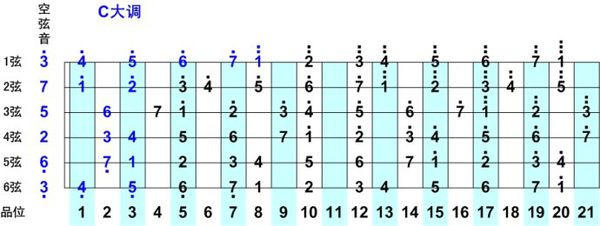

## 一、基本知识
1. 吉他的六根弦的标准音高：




## 二、吉他调音

1. [吉他在线调音](http://www.jitapu.com/others/tool_tx.htm)

### 2.1 吉他标准音怎么调

我们从一弦开始调，这里为什么先调一弦是因为防止其他琴弦先定音，导致一弦定音过高，最后使得一弦会出现断裂的现象出现（标准音高下肯定不会出现这种情况。如果出现了，请换琴），当然还有有人先调六弦原因是说六弦粗，张力大，如果后调有可能会导致指板轻微变形，从而使之前调好的音变的不准了。我们说的两种方法调弦采取先定一弦：

#### 1.泛音调弦法

*在后面的文字和链接中有简单介绍什么是泛音*

```
六弦5品泛音-五弦7品泛音一致
五弦5品泛音-四弦7品泛音一致
四弦5品泛音-三弦7品泛音一致
三弦4品泛音-二弦5品泛音一致
二弦5品泛音-一弦7品泛音一致
```

#### 2. 共振调弦法

**共振的原理**：共振是物理学上的一个运用频率非常高的专业术语。共振的定义是两个振动频率相同的物体，当一个发生振动时，引起另一个物体振动的现象。  

*吉他上的弦共振也是同样道理。假如2根弦发出的音一致（即振动频率一致）时，只要其中一根弦振动（用手弹），那么另一个弦也会振动（不用手弹也会振动）。于是我们要检验任意2个音是否一致，除了靠听觉听以外，用共振法就可以作为很好的辅助和检验了。*

```
从第一弦到第六弦依次调音:

二弦五品音 = 第一弦音
三弦四品音 = 第二弦音
四弦五品音 = 第三弦音
五弦五品音 = 第四弦音
六弦五品音 = 第五弦音

```
### 3. 定音笛法

工具:定音笛

方法:

1. 吹定音笛的1E孔,听声音,同时弹一弦空弦,比对二者差异,调整一弦,直到二者音调相同为止。

2. 吹定音笛的2B孔,听声音,同时弹二弦空弦,比对二者差异,调整二弦,直到二者音调相同。

3. 用同样的方法,3G,4D,5A,6E分别对应三、四、五、六弦。

这种方法我没试过，不能保证正确性。

#### 4. 电子调音器法


## 泛音

一般来讲，如果是民谣吉他，基本上使用自然泛音，一般在5品、7品、12品处，左手手指轻触琴弦5品、7品、或12品其中之一的位置（记着是在品柱的正上方）。右手拨弦的同时，左手手指放开，就会听到一种很特别的声音，这就是自然泛音。


## 其他


[泛音演奏的简单物理学原理](https://zhuanlan.zhihu.com/p/25732106)

[吉他调弦先调哪根弦？](https://zhidao.baidu.com/question/413147559.html)


<!-- 
[适合吉他初学者的调弦法-共振调弦法](https://site.douban.com/191314/widget/notes/11313378/note/252027241/)
[吉他调弦先调哪根弦？](https://zhidao.baidu.com/question/413147559.html)
[吉他调弦先调哪根弦？](https://zhidao.baidu.com/question/413147559.html)
[吉他调弦先调哪根弦？](https://zhidao.baidu.com/question/413147559.html)
 -->